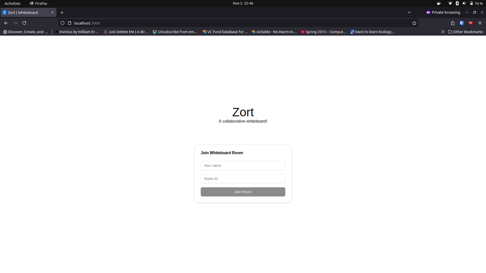
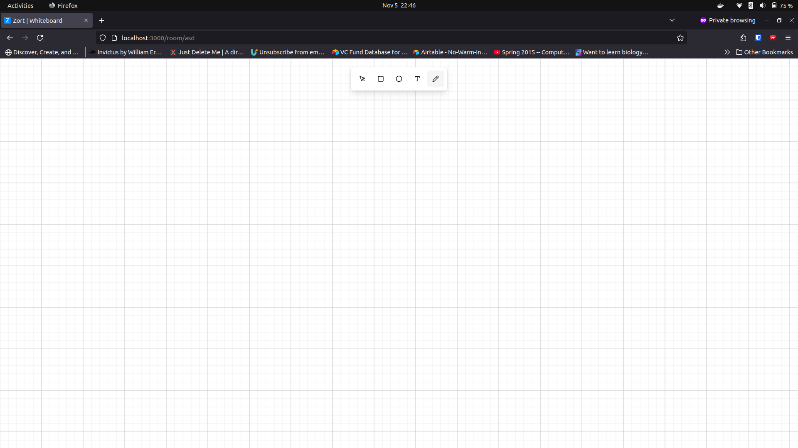

# Zort - Collaborative Whiteboard Application

A real-time collaborative whiteboard application built with Next.js, Socket.IO, and Framer Motion. Users can join rooms and collaborate on drawings in real-time.



## Features

- Real-time collaboration
- Multiple drawing tools:
  - Pencil tool for freehand drawing
  - Rectangle tool
  - Circle tool
  - Text tool
  - Eraser tool
- Selection and movement of elements
- Zoom and pan functionality
- Undo/redo support
- Color picker and stroke width controls
- Grid background
- Room-based collaboration
- LocalStorage persistence
- Responsive design



## Tech Stack

- **Frontend**:
  - Next.js 14
  - Framer Motion
  - Zustand for state management
  - Socket.IO client
  - Tailwind CSS
  - ShadcnUI components

- **Backend**:
  - Node.js
  - Socket.IO server
  - Express

- **Infrastructure(ongoing)**:
  - AWS ECS (Elastic Container Service)
  - AWS ECR (Elastic Container Registry)
  - AWS Route 53
  - AWS Application Load Balancer
  - AWS VPC
  - Docker

## Prerequisites

- Node.js 18 or higher
- npm or yarn
- Docker and Docker Compose
- AWS CLI (for deployment)

## Local Development

1. Clone the repository:

```bash
git clone https://github.com/yourusername/whiteboard-app.git
cd whiteboard-app
```

2. Install dependencies:

```bash
npm install
```

3. Set up environment variables:

```bash
# .env.local
NEXT_PUBLIC_SOCKET_URL=http://localhost:3001
```

4. Run the development server:

```bash
# Terminal 1: Run the frontend
npm run dev

# Terminal 2: Run the backend
node server/index.js
```

5. Open [http://localhost:3000](http://localhost:3000) in your browser

## Docker Development (Pending)

Run the entire application using Docker Compose:

```bash
docker-compose up --build
```

## Keyboard Shortcuts

- **V** - Select tool
- **R** - Rectangle tool
- **C** - Circle tool
- **T** - Text tool
- **P** - Pencil tool
- **E** - Eraser tool
- **Space** (hold) - Pan tool
- **Ctrl/Cmd + Z** - Undo
- **Ctrl/Cmd + Shift + Z** - Redo
- **Delete** - Delete selected element
- **Ctrl/Cmd + Mouse Wheel** - Zoom in/out

<!-- ## Deployment

### Prerequisites for Deployment

1. AWS Account with appropriate permissions
2. Domain name configured in Route 53
3. SSL certificate in AWS Certificate Manager
4. GitHub repository
5. Docker Hub account (optional) -->

<!-- ### Deployment Steps

1. Install AWS CDK globally:
```bash
npm install -g aws-cdk
```

2. Deploy the infrastructure:
```bash
cd infrastructure
npm install
cdk deploy
```

3. Set up GitHub Actions:
   - Add required secrets to your GitHub repository
   - Push to main branch to trigger deployment -->

## Project Structure

```
├── app/
│   ├── page.tsx
│   ├── room/
│   │   └── [roomId]/
│   │       └── page.tsx
│   └── layout.tsx
├── components/
│   ├── RoomEntry.tsx
│   ├── Whiteboard.tsx
│   └── toolbar/
│       ├── Toolbar.tsx
│       └── ToolButton.tsx
├── store/
│   └── useStore.ts
├── types/
│   └── index.ts
├── server/
│   ├── index.ts
│   └── socket.ts
├── infrastructure/
│   └── lib/
│       └── whiteboard-stack.ts
└── docker-compose.yml
```

## Security

- HTTPS enforced
- WebSocket over WSS
- Rate limiting implemented
- Security headers configured
- Regular dependency updates
- Container image scanning
- AWS security best practices implemented

## Environment Variables

```bash
# Frontend (.env.local)
NEXT_PUBLIC_SOCKET_URL=http://localhost:3001  # Development
NEXT_PUBLIC_SOCKET_URL=https://your-domain.com # Production

# Backend (.env)
PORT=3001
NODE_ENV=development/production
```
